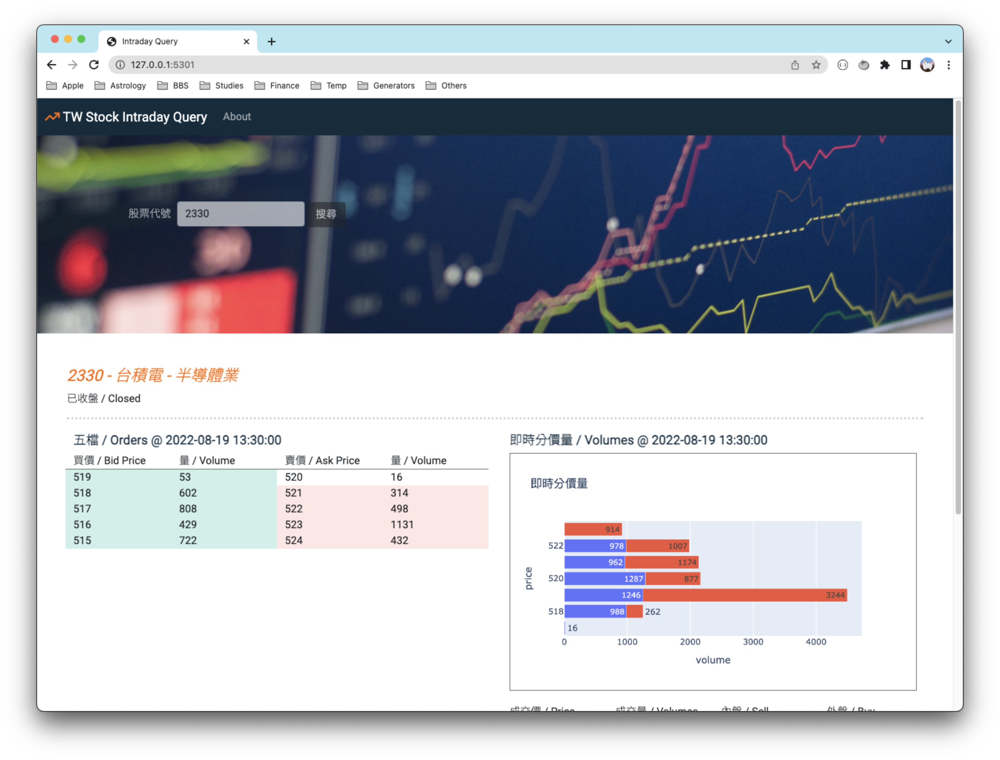

# Custom API Based Website

This web application project is a homework for *100 Days of Code: The Complete Python Pro Bootcamp for 2022.*

* 根據輸入的台股股號回傳五檔和即時份價量資訊 / Return Taiwan Stock intraday orders and volumes by given stock symbol.

[DEMO](https://cw-stock-query.herokuapp.com/)

### Reference

* [富果即時行情 API](https://developer.fugle.tw/docs/data/intro)
* [How to get python graph output into html webpage directly - Stack Overflow](https://stackoverflow.com/questions/49015957/how-to-get-python-graph-output-into-html-webpage-directly)
